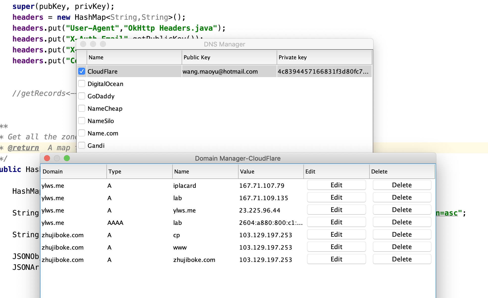

## Screenshots


## How To Run
### Run
```bash
cd scripts/
./CompileAndRun.sh
```
### Generate JavaDoc
```bash
cd scripts/
./GenerateDocs.sh
cd ../docs 	#To see all the generated javadocs.
```
Run CompileAndRun.cmd or CompileAndRun.sh under Scripts file to start the Application.

## How To Use

1. DNS Providers are shown on the main page. Users need type in the public key and private key, then select the checkbox in front the company name then click "config" to get to manage the domain.

2. In the domain manage frame, all domains under this DNS Provider will show in the frame. Then user can choose to add a new domain or edit or delect a exist domain.

## Slides
See [slides.pdf](slides.pdf)